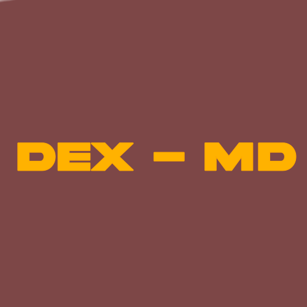

# visor de MD — DEX STUDIO



**Versión:** 1.0.0  
**Autor:** dex  
**Categoría:** Editor / Utility

---

## Descripción
Esta extensión permite previsualizar archivos Markdown (`.md`) dentro de DEX STUDIO de manera rápida y sencilla.  
Al presionar el botón **Preview MD** en la barra del editor, se abrirá una nueva pestaña mostrando tu Markdown en una vista limpia y estilizada.

---

## Funcionalidades
- Botón **Preview MD** en la barra del editor solo visible para archivos `.md`  
- Renderizado básico de Markdown:
  - Encabezados (`#`, `##`)
  - Negritas (`**texto**`)
  - Cursivas (`*texto*`)
  - Bloques de código (```)  
- Vista de preview limpia y legible  
- No interfiere con la edición de código

---

## Instalación
1. Copia la carpeta de la extensión a `modules/` dentro de DEX STUDIO.  
2. Asegúrate de que `icon.png` está en la misma carpeta que `README.txt` y `main.js`.  
3. Reinicia DEX STUDIO.  
4. La extensión se cargará automáticamente.

---

## Uso
1. Abre un archivo `.md` en DEX STUDIO.  
2. Haz clic en el botón **Preview MD** en la barra del editor.  
3. Se abrirá una pestaña mostrando tu Markdown en formato visual.  
4. Para actualizar la vista, vuelve a presionar el botón después de editar el archivo.

---

## Desarrollo
- Modifica `main.js` para agregar nuevas funciones o mejorar el renderizado.  
- Ajusta `manifest.json` si quieres cambiar nombre, icono o versión.  
- Sigue la guía interna de DEX para crear nuevas extensiones.

---

**¡Disfruta creando con DEX STUDIO!**